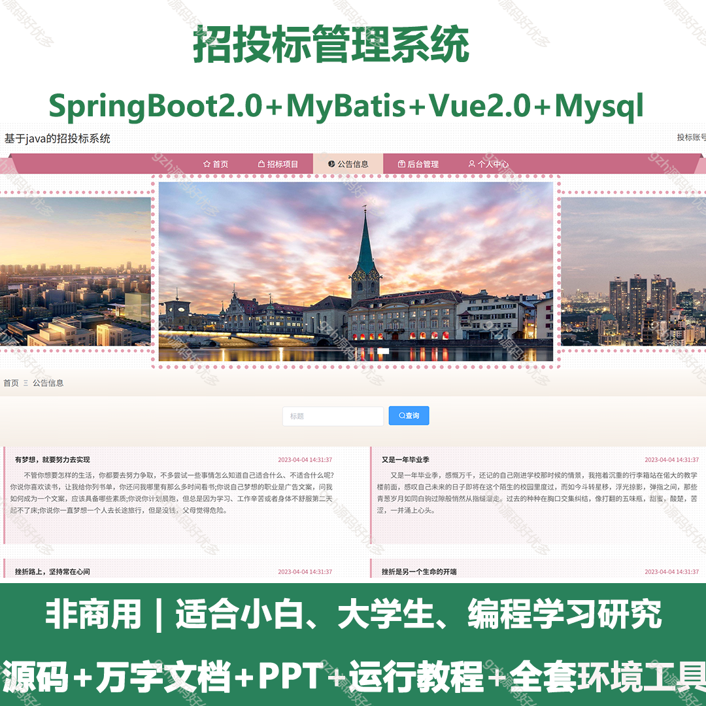
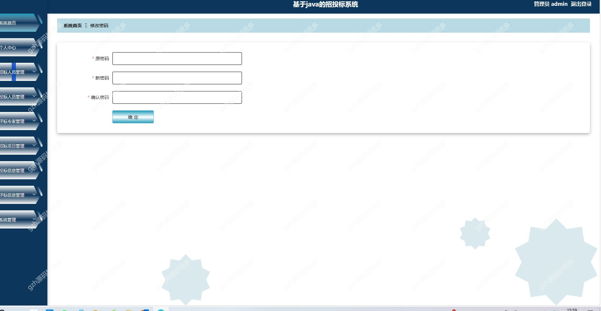
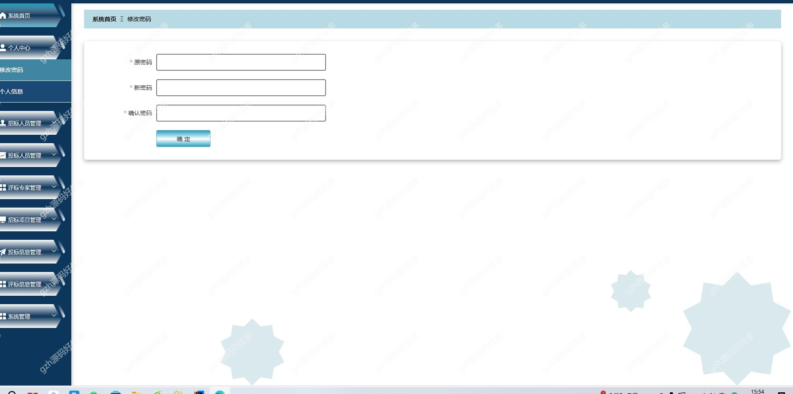
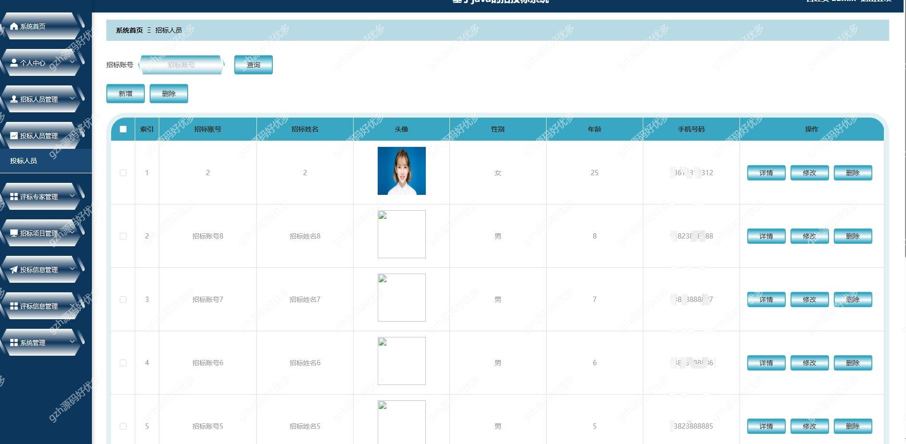
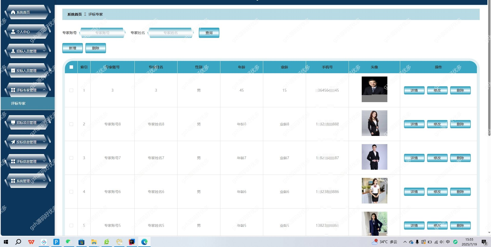
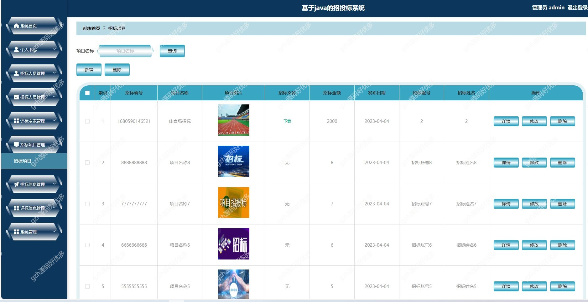
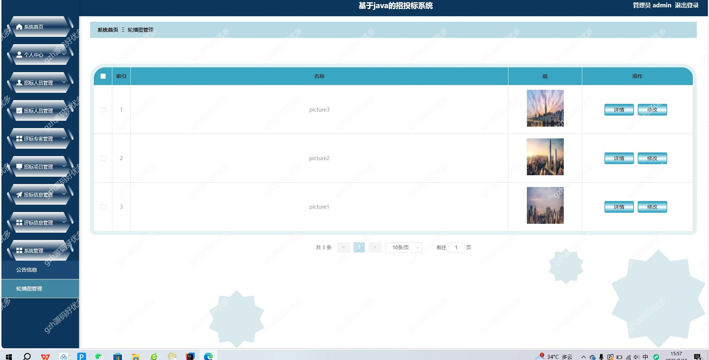
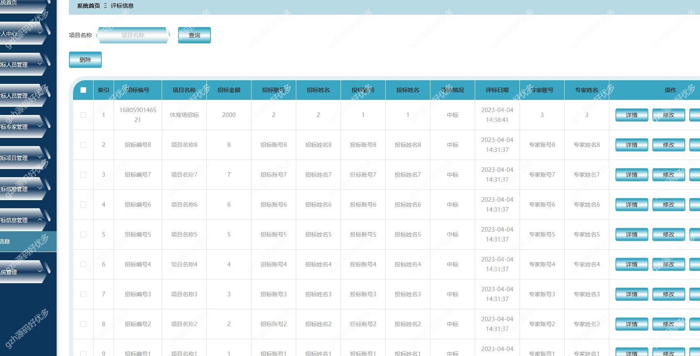
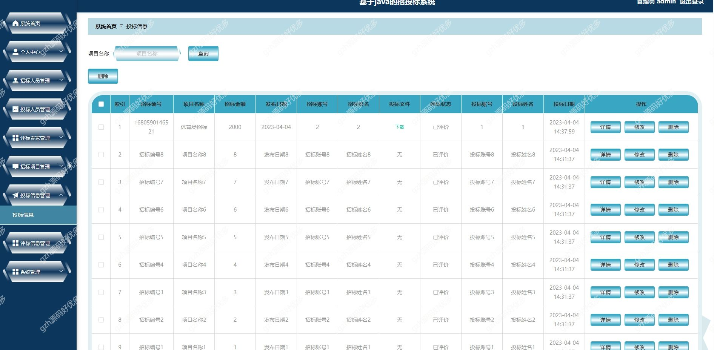

# springbootA301
springbootA301招投标系统+LW+PPT
 
## 查看主页获取源码

### 一、关键词
招投标 投标  招标系统

### 二、作品包含
源码+数据库+万字设计文档+PPT+全套环境和工具资源+本地部署教程

### 三、项目技术
前端技术：Vue2.0、Element + Axios、Vue Router
后端技术：Java、SpringBoot2.0、MyBatis

### 四、运行环境（以下版本亲测，其他版本兼容性请自行测试）
开发工具：IDEA/eclipse  + VSCODE

数据库：MySQL5.7

数据库管理工具：Navicat10以上版本

环境配置软件： JDK1.8 + Maven3.6.3

前端Nodejs：14

浏览器：谷歌浏览器

### 五、项目介绍
项目编号：springbootA301

招投标系统采用B/S架构，数据库是MySQL。网站的搭建与开发采用了先进的Java进行编写，使用了SpringBoot框架。该系统从四个对象：由管理员和招标人员、评标专家、投标人员来对系统进行设计构建。主要功能包括：个人信息修改，对招标人员信息、投标人员信息、评标专家信息、招标项目、投标信息、评标信息等功能进行管理。本系统在一般招投标系统的基础上增加了首页推送最新信息的功能，方便用户快速浏览，是一个高效的、动态的、交互友好的招投标系统。
### 六、运行截图

